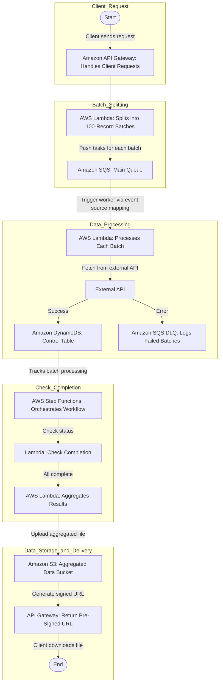

# Contact Enrichment Microservice

## Overview

The **Contact Enrichment Microservice** is a scalable solution for enriching contact data using various data providers. The service splits large contact lists into manageable batches, processes these batches via AWS Lambda, and integrates with a step function to ensure all batches are processed before aggregating results into an output file in S3.

This project leverages Terraform for infrastructure as code, Python for Lambda functions, and an automated deployment script.

---

## Features

- **Batch Splitting**: Breaks down large contact lists (up to 100k records) into batches of 100.
- **Data Provider Integration**: Follows a Factory Pattern to modulate the Data Provider Integration.
- **DynamoDB for State Management**: Tracks batch processing state and store results for aggregation.
- **AWS Step Functions**: Orchestrates batch processing and triggers aggregation after completion.
- **API Gateway**: Provides endpoints for initiating the enrichment process and checking batch status.
- **S3 Output**: Stores the aggregated enriched data file.
- **Terraform Modules**: Infrastructure as code to deploy and manage all resources.

---

## Architecture

### Diagram



### Key Components
1. **API Gateway**: Accepts requests and routes them to the appropriate Lambda functions.
2. **AWS Lambda Functions**:
   - **Split Batches**: Splits contacts into batches and pushes them to an SQS queue.
   - **Worker**: Processes each batch by enriching records and saving results to DynamoDB.
   - **Check Completion**: Verifies if all batches have been processed.
   - **Aggregation**: Aggregates enriched records into a single file and uploads to S3.
3. **SQS**: Queues batches for worker processing and store failed attempts in a Dead Letter Queue.
4. **DynamoDB**: Tracks state for batch processing and store results from Data Providers for aggregation.
5. **S3**: Stores the aggregated output file.

### Workflow
1. The client sends a contact list via the `/process` API endpoint.
2. The service splits the list into batches and queues them in SQS.
3. Worker Lambdas process each batch and update DynamoDB.
4. A step function monitors progress and triggers aggregation once all batches are processed.
5. The aggregated file is stored in S3 and a pre-signed URL is provided.

---

## Project Structure

```
.
├── lambdas/
│   ├── __init__.py
│   ├── aggregate_results/
│   │   ├── __init__.py
│   │   ├── app.py
│   │   ├── requirements.txt
│   │   └── tests/
│   │       ├── __init__.py
│   │       └── test_app.py
│   ├── check_completion/
│   │   ├── __init__.py
│   │   ├── app.py
│   │   ├── requirements.txt
│   │   └── tests/
│   │       ├── __init__.py
│   │       └── test_app.py
│   ├── split_batches/
│   │   ├── app.py
│   │   ├── requirements.txt
│   │   ├── tests/
│   │   │   ├── __init__.py
│   │   │   └── test_app.py
│   │   ├── batch_splitter/
│   │   │   ├── __init__.py
│   │   │   └── batch_splitter.py
│   │   ├── control_table/
│   │   │   ├── __init__.py
│   │   │   └── control_table.py
│   │   ├── request_processor/
│   │   │   ├── __init__.py
│   │   │   └── request_processor.py
│   │   ├── sqs_queue/
│   │       ├── __init__.py
│   │       └── sqs_queue.py
│   ├── worker/
│   │   ├── app.py
│   │   ├── requirements.txt
│   │   ├── tests/
│   │   │   ├── __init__.py
│   │   │   └── test_app.py
│   │   ├── batch_processor/
│   │   │   ├── __init__.py
│   │   │   └── batch_processor.py
│   │   ├── data_provider/
│   │   │   ├── __init__.py
│   │   │   └── data_provider.py
│   │   ├── dynamodb/
│   │   │   ├── __init__.py
│   │   │   └── dynamodb.py
│   │   ├── provider_factory/
│   │       ├── __init__.py
│   │       └── provider_factory.py
├── terraform/
│   ├── modules/
│   │   ├── api_gateway/
│   │   ├── dynamodb/
│   │   ├── iam/
│   │   ├── lambda/
│   │   ├── s3_bucket/
│   │   ├── sqs/
│   │   ├── step_functions/
│   ├── main.tf
│   ├── variables.tf
│   └── outputs.tf
├── .gitignore
├── deploy.sh
├── README.md
├── requirements.txt
└── run_tests.sh
```

---

## Prerequisites

1. **AWS CLI** installed and configured.
2. **Python 3.10** and `pip` installed.
3. **OpenTofu CLI** installed.

---

## Setup Instructions

### 1. Clone the Repository
```bash
git clone <repository-url>
cd <repository-directory>
```

### 2. Package Lambda Functions
Run the deployment script to package the Lambda functions:
```bash
chmod +x deploy.sh
bash deploy.sh
```

This will generate ZIP files for each Lambda function in `lambdas/deployment`.

### 3. Initialize OpenTOFU
Navigate to the Terraform directory and initialize the workspace:
```bash
cd terraform
tofu init
```

### 4. Plan and Validate Infrastructure
Run OpenTOFU to validate and plan the entire stack:
```bash
tofu validate
tofu plan
```

### 5. Deploy the Infrastructure
Run OpenTOFU to deploy the entire stack:
```bash
tofu apply
```

### 6. Note API Gateway Endpoints
Once deployed, note the API Gateway URL from the OpenTOFU output.

---

## Testing

### 1. Run Unit Tests
Create a virtual environment, install the requirements.txt and execute the script to run Pytest.
```bash
python3.10 -m venv .venv
source .venv/bin/activate
pip install -r requirements.txt

chmod +x run_tests.sh
./run_tests.sh  
```

### 2. Test the Endpoints
Use tools like `curl` or Postman to test the API Gateway endpoints:
- **Start Enrichment**: `POST /process`
- **Check Status**: `GET /status/{id}`

---

## Configuration

### Environment Variables
Ensure the following environment variables are set in Terraform:
- `AWS_ACCESS_KEY_ID`: AWS Access Key
- `AWS_SECRET_ACCESS_KEY`: AWS Secret
- `SQS_QUEUE_URL`: SQS Queue URL.
- `DYNAMO_TABLE_NAME`: Name of the DynamoDB records table.
- `CONTROL_TABLE_NAME`: Name of the DynamoDB Control Table .
- `S3_BUCKET_NAME`: Name of the S3 bucket for storing aggregated files.

### Route Configuration
Define your API Gateway routes in `api_gateway` module:
```hcl
routes = {
  "POST /process"   = module.lambda_split_batches.lambda_arn
  "GET /status/{id}" = module.lambda_check_completion.lambda_arn
}
```

---

## Monitoring & Logging

- **CloudWatch Logs**: All Lambda logs are available in AWS CloudWatch.
- **Metrics**: API Gateway and Lambda usage metrics are available in the AWS Management Console.

---

## Future Improvements

- **Add Support for Multiple Data Providers**: Enhance the `ProviderFactory` for extensibility.
- **Error Handling and Retries**: Improve error handling and implement retries for transient failures.
- **API Security**: Add API Key or JWT-based authentication for endpoints.
- **Horizontal Scaling**: Introduce Lambda provisioned concurrency for high-throughput scenarios.

---

## Author

Developed by Fred Browne.

---

